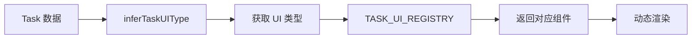

# 任务UI组件系统使用说明

## 📋 概述

任务UI组件系统是一个**可扩展的组件注册架构**，用于根据任务类型动态渲染不同的交互界面。

### 核心优势

- ✅ **可扩展**：轻松添加新的任务UI类型
- ✅ **解耦合**：任务数据与UI组件分离
- ✅ **智能推断**：自动根据任务名称匹配UI组件
- ✅ **类型安全**：完整的TypeScript类型支持

---

## 🏗️ 架构设计

### 组件结构

```
src/components/task-ui/
├── TaskUIRegistry.tsx        # 组件注册表和类型推断逻辑
├── DefaultTaskUI.tsx          # 默认任务详情展示
├── TemplateSelectionUI.tsx   # 模板选择界面
├── FileUploadUI.tsx          # 文件上传界面（待实现）
├── ConfirmationUI.tsx        # 确认对话框（待实现）
└── README.md                  # 使用文档
```

### 工作流程



---

## 🚀 快速开始

### 1. 使用已有的UI组件

在Task数据中指定 `uiComponentType`：

```typescript
const task: Task = {
  id: 'task-001',
  stageId: 'stage-01',
  name: '选择宪章模板',
  description: '从预设模板中选择适合的宪章',
  status: TaskStatus.InProgress,
  createdAt: new Date().toISOString(),
  metadata: {
    uiComponentType: 'template-selection', // 指定使用模板选择UI
    uiProps: {
      // 传递给UI组件的额外属性
      templates: [ /* 自定义模板列表 */ ]
    }
  }
};
```

### 2. 基于任务名称自动推断

如果不指定 `uiComponentType`，系统会根据任务名称自动推断：

```typescript
// 这些任务名称会自动匹配到 template-selection UI
{ name: '选择项目模板' }           // ✅ 包含"模板"
{ name: '确立宪章' }              // ✅ 包含"宪章"
{ name: 'Template Selection' }    // ✅ 包含"template"

// 这些任务名称会自动匹配到 file-upload UI
{ name: '上传需求文档' }          // ✅ 包含"上传"
{ name: 'Upload Attachment' }     // ✅ 包含"upload"

// 其他任务使用 default UI
{ name: '审核代码' }              // 使用默认UI
```

---

## 🔧 添加新的UI组件类型

### 步骤 1：定义UI类型

在 `TaskUIRegistry.tsx` 中添加新类型：

```typescript
export type TaskUIType =
  | 'template-selection'
  | 'file-upload'
  | 'my-new-ui'        // ← 新增类型
  | 'default';
```

### 步骤 2：创建UI组件

创建 `MyNewUI.tsx`：

```typescript
import type { TaskUIComponentProps } from './TaskUIRegistry';

export function MyNewUI({ task, onComplete, onCancel }: TaskUIComponentProps) {
  return (
    <div style={{ padding: '16px' }}>
      <h3>自定义任务UI</h3>
      <p>任务名称: {task.name}</p>
      {/* 实现您的UI逻辑 */}
      <button onClick={() => onComplete({ result: 'success' })}>
        完成
      </button>
    </div>
  );
}
```

### 步骤 3：注册组件

在 `TaskUIRegistry.tsx` 中注册：

```typescript
import { MyNewUI } from './MyNewUI';

export const TASK_UI_REGISTRY: Record<TaskUIType, TaskUIComponent> = {
  'template-selection': TemplateSelectionUI,
  'file-upload': FileUploadUI,
  'my-new-ui': MyNewUI,           // ← 注册新组件
  'default': DefaultTaskUI,
};
```

### 步骤 4：添加推断规则（可选）

在 `inferTaskUIType` 函数中添加推断逻辑：

```typescript
export function inferTaskUIType(task: Task): TaskUIType {
  if (task.metadata?.uiComponentType) {
    return task.metadata.uiComponentType as TaskUIType;
  }

  const taskName = task.name.toLowerCase();

  // 新增推断规则
  if (taskName.includes('自定义关键词')) {
    return 'my-new-ui';
  }

  // ... 其他规则

  return 'default';
}
```

---

## 📝 组件Props接口

所有任务UI组件必须实现 `TaskUIComponentProps` 接口：

```typescript
export interface TaskUIComponentProps {
  task: Task;                          // 任务数据
  onComplete?: (result?: any) => void; // 完成回调
  onCancel?: () => void;               // 取消回调
}
```

### Props说明

| 属性 | 类型 | 必填 | 说明 |
|------|------|------|------|
| `task` | `Task` | ✅ | 任务数据对象 |
| `onComplete` | `Function` | ❌ | 任务完成时调用，可传递结果数据 |
| `onCancel` | `Function` | ❌ | 任务取消时调用 |

---

## 🎨 现有UI组件

### DefaultTaskUI

**用途**：默认任务详情展示
**适用场景**：没有特定交互需求的任务

**特性**：
- 展示任务基本信息（名称、描述、状态、时间）
- 自动展示任务元数据（调试用）
- 响应式布局

### TemplateSelectionUI

**用途**：模板选择界面
**适用场景**：需要从多个模板中选择一个的任务（如宪章模板、项目模板）

**特性**：
- Radio单选界面
- 实时模板预览
- 支持自定义模板列表（通过 `task.metadata.uiProps.templates`）
- 确认/取消操作

**使用示例**：

```typescript
const task: Task = {
  // ... 基本信息
  metadata: {
    uiComponentType: 'template-selection',
    uiProps: {
      templates: [
        {
          id: 'custom-1',
          name: '自定义模板',
          description: '这是一个自定义模板',
          content: '模板内容...'
        }
      ]
    }
  }
};
```

---

## 🧪 测试和调试

### 查看任务UI类型推断

```typescript
import { inferTaskUIType } from '@/components/task-ui/TaskUIRegistry';

const task = { name: '选择宪章模板', ... };
const uiType = inferTaskUIType(task);
console.log('推断的UI类型:', uiType); // 'template-selection'
```

### 查看任务元数据

DefaultTaskUI 会自动展示任务的 metadata，便于调试：

```typescript
task.metadata = {
  uiComponentType: 'template-selection',
  customField: 'debug-value'
};
// 在DefaultTaskUI中会以JSON格式展示
```

---

## 🔮 未来扩展

### 计划中的UI组件类型

- ✅ `template-selection` - 已实现
- ✅ `default` - 已实现
- 🚧 `file-upload` - 文件上传界面
- 🚧 `confirmation` - 确认对话框
- 🚧 `form-input` - 表单输入
- 🚧 `code-review` - 代码审查
- 🚧 `approval` - 审批流程

### 扩展建议

1. **异步数据加载**：支持组件内部异步加载数据
2. **状态持久化**：保存用户在UI中的操作状态
3. **嵌套组件**：支持复杂任务的多步骤UI
4. **权限控制**：根据用户权限动态调整UI功能

---

## ❓ 常见问题

### Q: 如何在对话框中触发任务UI的显示？

A: 当AI响应中提到某个任务时，后端应返回任务ID，前端自动选中该任务，右侧面板会自动切换到对应的UI组件。

### Q: 一个任务可以有多个UI阶段吗？

A: 可以。可以通过任务状态（status）或元数据（metadata）动态改变 `uiComponentType`，实现多阶段UI。

### Q: 如何传递自定义数据给UI组件？

A: 使用 `task.metadata.uiProps`：

```typescript
metadata: {
  uiComponentType: 'my-ui',
  uiProps: {
    customData: { key: 'value' },
    options: ['A', 'B', 'C']
  }
}
```

在组件中访问：

```typescript
const customData = task.metadata?.uiProps?.customData;
```

---

## 📚 相关文档

- [DESIGN.md](../../DESIGN.md) - 整体前端设计文档
- [Task数据模型](../../types/models.ts) - Task类型定义
- [WorkflowStore](../../stores/useWorkflowStore.ts) - 工作流状态管理

---

**最后更新**：2025-10-27
**维护者**：AI产研教练团队
